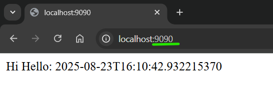

# Devops Guide

### Docker Documentation

etc:

Ex.1;

### Docker Commands

etc:

Ex.1;


#### --- ###

# DevOps

### Docker Documentation


```
docker login -u           floryos    -p          123456789

docker login --username   floryos    --password  123456789

docker login -u           floryos    --password  123456789

```

```
docker run    --name   my-postgres   -e POSTGRES_USER=postgres    -e POSTGRES_PASSWORD=123456789   -e POSTGRES_DB=postgres  -p 9999:5432    -d postgres
```


### ===============  kendi jarlarımızı image olarak docker'a verme  ======================

```
docker build    --build-arg   JAR_FILE=target/devops-01-1.0.1.jar      --tag floryos/devops-01:v001   .
```
docker build    --build-arg   JAR_FILE=target/devops-01-1.0.1.jar      --tag floryos/devops-01:latest   .
```
docker build    --build-arg   JAR_FILE=target/devops-01-1.0.2.jar      --tag floryos/devops-01:v002   .
```
docker build    --build-arg   JAR_FILE=target/devops-01-1.0.2.jar      --tag floryos/devops-01:latest   .
```
docker build    --build-arg   JAR_FILE=target/devops-01-1.0.3.jar      --tag floryos/devops-01:v003   .
```
docker build    --build-arg   JAR_FILE=target/devops-01-1.0.3.jar      --tag floryos/devops-01:latest   .
```


### ===============  kendi imagelerimizi container olarak çalıştırma ======================


```
docker           run       -it     -d           --name my-app1         -p 8081:8080                      floryos/devops-01:v001
```

```
docker container run       -it     -d           --name my-app1         -p 8081:8080                      floryos/devops-01:v001
```

```
docker  run       -it     -d           --name my-app2         -p 8082:8080                      floryos/devops-01:v002
```

```
docker  run       -it     -d           --name my-app3         -p 8083:8080                      floryos/devops-01:latest
```

```
docker  run       -it     -d           --name my-app4         -p 8084:8080                      floryos/devops-01:v003
```


http://localhost:8081 </br>
http://localhost:8082 </br>
http://localhost:8083 </br>
http://localhost:8084 </br>


### ===============  kendi imagelerimizi dockerhub'a gönderme  ======================
```
docker push floryos/devops-01:v001
docker push floryos/devops-01:latest
```

### ===============  kendi imagelerimizi dockerhub'dan çekme  ======================
```
docker pull floryos/devops-01:v001
docker pull floryos/devops-01:latest
```


### ============== network ==============
### networkleri listele

```
docker network ls
```

### yeni bir network oluştur
```
docker network create my-network
```

### network tipini değiştirmek istiyorsanız --driver parametresi
```
docker network create --driver bridge my-network
```


### network bilgisi ve onu kullanan containerlar
```
docker network inspect my-network
```


### networke container ekleme
```
docker network connect my-network my-app1
docker network connect my-network my-app2
docker network connect my-network my-app3
```

### network bilgisi ve onu kullanan containerlar
```
docker network inspect my-network
```

### networke container çıkarma
```
docker network disconnect my-app2
```


### network bilgisi ve onu kullanan containerlar
```
docker network inspect my-network
```

### networkü silme
```
docker network rm my-network
```


### ============== volume ==============
```
docker volume ls
```
### Yeni bir volume oluşturmak
```
docker volume create my-volume
```

```
docker volume ls
```

```
docker volume inspect my-volume
```

### bir volume silmek
```
docker volume rm my-volume
```

### kullanılmayan tüm volumeleri silmek
```
docker volume prune
```

### ============= docker-compose ===================
```
docker compose -f docker-compose.yml up

docker compose -f docker-compose.yaml up
```

```
docker ps
```

```
docker container ls
```

```
docker-compose logs mongo
docker-compose logs -f  mongo
```


```
docker compose -f docker-compose.yml down

docker compose -f docker-compose.yaml down
```

```
kubectl version
```


```
kubectl run    my-pod1    --image=mimaraslan/devops-01-hello:latest
kubectl run    my-pod2    --image=mimaraslan/devops-01-hello:v002
kubectl run    my-pod3    --image=mimaraslan/devops-01-hello:v003

kubectl get pods


kubectl run    my-pod4    --image=mimaraslan/devops-01-hello:v004

kubectl get pods


kubectl delete -n default pod my-pod4

kubectl get pods


kubectl run    my-pod4    --image=mimaraslan/devops-01-hello:v004

kubectl get pods


kubectl run    my-pod5    --image=mimaraslan/devops-01-hello:v001
kubectl run    my-pod6    --image=mimaraslan/devops-01-hello:v002
kubectl run    my-pod7    --image=mimaraslan/devops-01-hello:v003


kubectl run    my-pod8    --image=mysql

kubectl delete pod my-pod8

kubectl get pods


kubectl get pods   
kubectl get pod
kubectl get po

kubectl get pods   -o wide
kubectl get pod   -o wide
kubectl get po   -o wide


kubectl get nodes   
kubectl get node
kubectl get no

kubectl get nodes   -o wide
kubectl get node   -o wide
kubectl get no   -o wide
```

===   pod ===
```

kubectl apply -f    _01_my_pod_create.yaml

kubectl get pods  -o wide

kubectl delete pod    devops-01-hello

kubectl get pods

```

===   deployment ===


```
kubectl apply -f   _01_my_deployment_create.yaml

kubectl delete deployment devops-01-hello


kubectl get deployment

kubectl get deploy

kubectl get deployment  -o wide

kubectl get deploy  -o wide
```

===   service  ===
```

kubectl apply -f   _01_my_service_create.yaml

kubectl delete service devops-01-hello


kubectl get services  -o wide

kubectl get service  -o wide

kubectl get svc  -o wide

```

== İşin bitinceye minikube'ü durur ve terminali kapat. ===
```
minikube stop
```


<hr>

### Ödevinizin cevabı

#### 1. Adım:
   yaml dosyalarında tüm portları 8080 yapın.


#### 2. Adım
   Deployment dosyasını çalıştırın.
```
kubectl apply -f   _01_my_deployment_create.yaml
```


#### 3. Adım
   Service dosyasını çalıştırın.
```
kubectl apply -f   _01_my_service_create.yaml
```

4. Adım aşağıdaki komutu çalıştırın. Otomatik olarak bir port verilecek ve uygulama K8s üzerinde çalıştırılacak.

minikube service    SERVISE_VERDIGINIZ_AD  
```
minikube service    devops-01-hello
```


Buradaki port otomatik verildi.


<hr>

İlle de 9090'dan çalıştırmak için service dosyasında dış port ile type kısmını değiştireceğiz.

1. Adım:


#### 2. Adım
Deployment dosyasını yeniden çalıştırın.
```
kubectl apply -f   _01_my_deployment_create.yaml
```


#### 3. Adım
Service dosyasını yeniden çalıştırın.
```
kubectl apply -f   _01_my_service_create.yaml
```


4. Adım aşağıdaki komutu çalıştırın. Localde port artık  9090 olacak.

```
kubectl port-forward service/devops-01-hello 9090:9090
```

